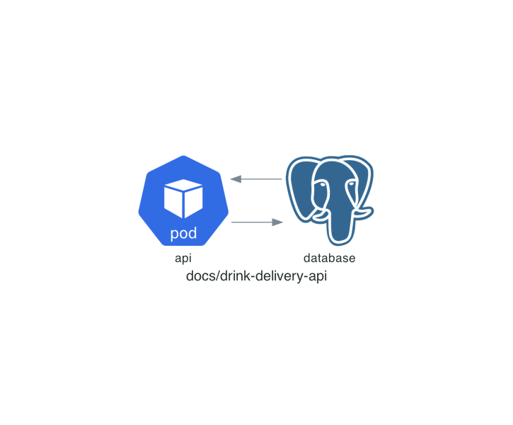

# drink-delivery-api

[](https://www.python.org/downloads/release/python-383/) [](https://github.com/cantoniazzi/drink-delivery-api/actions/workflows/main.yml)

It's responsible for managing the registration flow of beverage distributors.

## architecture



## built With

- [Python 3.8.3](https://www.python.org/downloads/release/python-383/)
- [Pipenv](https://github.com/pypa/pipenv)
- [FastAPI](https://github.com/tiangolo/fastapi)
- [Uvicorn](https://github.com/encode/uvicorn)
- [Sql Alchemy](https://www.sqlalchemy.org/)
- [GeoAlchemy2](https://geoalchemy-2.readthedocs.io/en/latest/)
- [Docker](https://www.docker.com/get-started)
- [Docker Compose](https://docs.docker.com/compose/)

## docs

Run the API:

```sh
make docker/run
```

and access:

docs: [http://localhost:5000/docs](http://localhost:5000/docs)  || redoc: [http://localhost:5000/redoc](http://localhost:5000/redoc)

## monitoring

- [X] - [Sentry](https://sentry.io/organizations/cassiosvaldo/issues/?project=5685277)

We have also configured the `/ metrics` route that exports metrics for [prometheus](https://prometheus.io/).

### How to build

```sh
make docker/build
```

## how to run

```sh
make docker/run
```

If you want to run / debug the site, you can use the vscode [launch.json](https://github.com/cantoniazzi/drink-delivery-api/blob/main/.vscode/launch.json) suggested by the project

## how to lint

```sh
make docker/lint
```

## how to test

```sh
make docker/test-unit
make docker/test-integration
```

We separate a specific [document](https://github.com/cantoniazzi/drink-delivery-api/blob/main/settings.toml#L10) to be used in the integrations tests in a parameterized way. You can change this number in the configuration if you wish.

## how to deploy

For the CD process, a GH workflow should be created, which is triggered by the case of a new release and thus, executes the commands to deploy the application to the respective environment.

##### k8s way

In the deploy directory, there is a sample of Kubernetes app deployment which you can use as a template if you want and if your infrastructure is prepared for Kubernetes apps. If you choose to do so, you'll need to include a command in the CD flow to add the deployment to your cluster. Check out more information [here](https://kubernetes.io/docs/concepts/workloads/controllers/deployment/):

##### AWS lambda way

If you choose to deploy this API as a lambda, you will have to use a library that envelopes the code into the lambda format (this lib [Mangum](https://github.com/jordaneremieff/mangum) might make sense) and then proceeds to the lambda deployment process usually using flow with AWS [S3](https://aws.amazon.com/s3) and AWS [SAM](https://docs.aws.amazon.com/serverless-application-model/latest/developerguide/sam-cli-command-reference-sam-deploy.html). If you choose to do so, you'll need to include a command in the CD flow to add the deployment to your cluster.

##### database

For the creation of the database, we recommend that you create a [cloud formation template](https://docs.aws.amazon.com/pt_br/AWSCloudFormation/latest/UserGuide/aws-properties-rds-database-instance.html) and then run it on the AWS panel to create the database. Once it's done, it will be necessary to create the API table in your bank and for that, you should use the .sql script contained in the database directory of this repository.

## miscellanies

To update the project diagram initilize your local environment:

```sh
make local/init
```

So run the command:

```sh
make local/diagram
```
